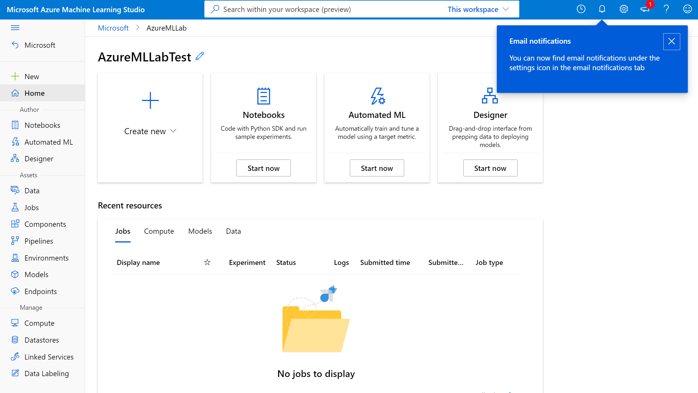
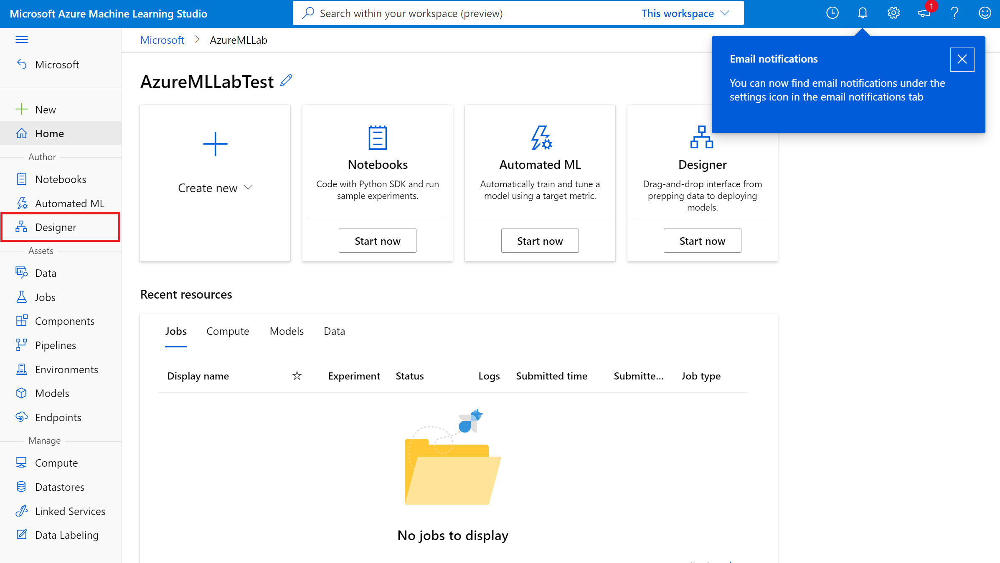
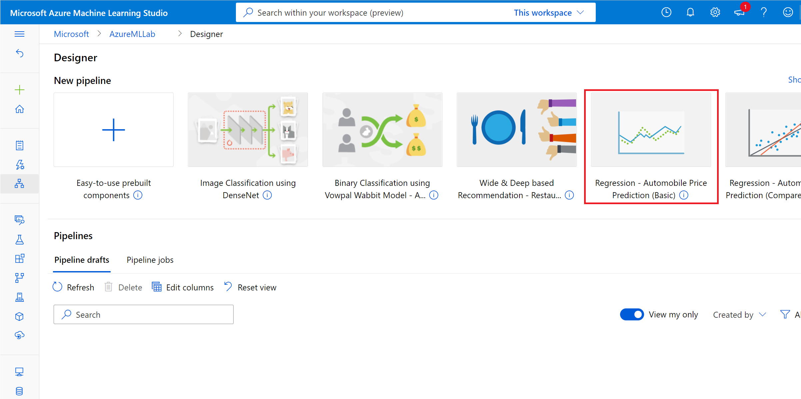
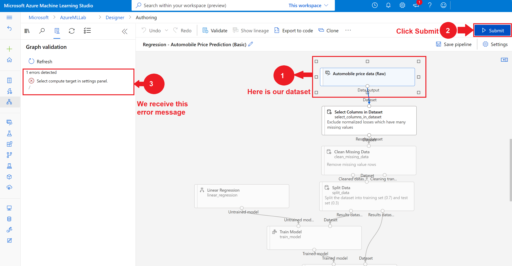
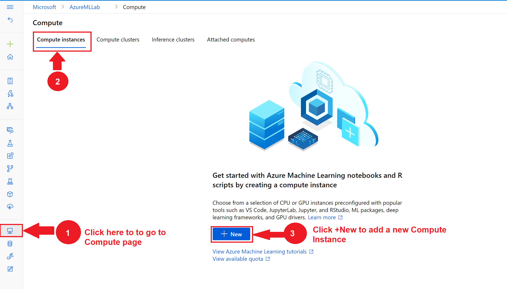

---
lab:
    title: 'Explore the Azure Machine Learning workspace'
---

# Explore the Azure Machine Learning workspace

Azure Machine Learning provides a data science platform to train and manage machine learning models. In this lab, you'll create an Azure Machine Learning workspace and explore the various ways to work with the workspace. The lab is designed as an introduction of the various core capabilities of Azure Machine Learning and the developer tools. If you want to learn about the capabilities in more depth, there are other labs to explore.

This lab will take approximately **30** minutes to complete.

## Before you start

You'll need an [Azure subscription](https://azure.microsoft.com/free) in which you have administrative-level access.

## Provision an Azure Machine Learning workspace

An Azure Machine Learning *workspace* provides a central place for managing all resources and assets you need to train and manage your models. You can provision a workspace using the interactive interface in the Azure portal, or you can use the Azure CLI with the Azure Machine Learning extension. In most production scenarios, it's best to automate provisioning with the CLI so that you can incorporate resource deployment into a repeatable development and operations (*DevOps*) process. 

In this exercise, you'll use the Azure portal to provision Azure Machine Learning to explore all options.

1. Sign into the [Azure portal](https://portal.azure.com).
2. Create a new **Machine Learning** resource with the following settings:
    - **Subscription**: *Your Azure subscription*
    - **Resource group**: *Create or select a resource group*
    - **Workspace name**: *Enter a unique name for your workspace*
    - **Region**: *Select the geographical region closest to you*
    - **Storage account**: *Note the default new storage account that will be created for your workspace*
    - **Key vault**: *Note the default new key vault that will be created for your workspace*
    - **Application insights**: *Note the default new application insights resource that will be created for your workspace*
    - **Container registry**: None (*one will be created automatically the first time you deploy a model to a container*)

> **Note**: When you create an Azure Machine Learning workspace, you can use some advanced options to restrict access through a *private endpoint* and specify custom keys for data encryption. We won't use these options in this exercise - but you should be aware of them!

3. Wait for the workspace and its associated resources to be created - this typically takes around 5 minutes. 

## Explore the Azure Machine Learning Studio

*Azure Machine Learning Studio* is a web-based portal through which you can access the Azure Machine Learning workspace. You can use the Azure Machine Learning Studio to manage all assets and resources within your workspace to train and deploy machine learning models. 

1. When the Azure Machine Learning workspace is created in the Azure portal, go to the resource group in which it has been created. Notice that the resource group contains your Azure Machine Learning workspace, an Application Insights, a Key Vault, and a Storage Account. 
1. Select your Azure Machine Learning workspace, and in its **Overview** page, select **Launch studio**. Another tab will open in your browser to open the Azure Machine Learning Studio.
1. On the left side of the Studio, the different pages within the Studio are shown. If only the symbols are visible in the menu, select the &#9776; icon to expand the menu and explore the names of the pages. 
1. Note the **Author** section, which includes **Notebooks**, **Automated ML**, and the **Designer**. These are the three ways you can create your own machine learning models within the Azure Machine Learning Studio.
1. Note the **Assets** section, which includes **Data**, **Jobs**, and **Models** among other things. Assets are either consumed or created when training or scoring a model. Assets are used to train, deploy, and manage your models and can be versioned to keep track of your history.
1. Note the **Manage** section, which includes **Compute** and **Datastores** among other things. These are infrastructural resources needed to train or deploy a machine learning model. 

## Author a training pipeline

To explore the use of the assets and resources in the Azure Machine Learning workspace, let's try and train a model. 

A quick way to author a model training pipeline is by using the **Designer**.

1. On the left side of the Studio, form the menu, select the **Designer** page.

1. You can create a new pipeline from scratch using prebuilt components, but you can also explore a sample. Select the **Regression - Automobile Price Prediction (Basic)** sample.

1. Note a new pipeline appears. At the top of the pipeline, a component is shown to load **Automobile price data (raw)**. Next, the pipeline processes the data and trains a linear regression model to predict the price for each automobile.
1. Select **Submit** at the top of the page. An error appears as you have not select a compute target yet. The pipeline can't run without compute resources. 

Let's create a compute target.

## Create a compute target

To run any workload within the Azure Machine Learning workspace, you'll need a compute resource. One of the benefits of Azure Machine Learning is the ability to create cloud-based compute on which you can run experiments and training scripts at scale.

1. In the Azure Machine Learning Studio, select the **Compute** page from the menu on the left side. There are four kinds of compute resources you can use:
    - **Compute instances**: A virtual machine managed by Azure Machine Learning. Ideal for development when you're exploring data and iteratively experimenting with machine learning models. 
    - **Compute clusters**: Scalable clusters of virtual machines for on-demand processing of experiment code. Ideal for running production code or automated jobs.
    - **Inference clusters**: A Kubernetes cluster used during inference. Ideal for real-time model deployment at a large scale.
    - **Attached compute**: Attach your existing Azure compute resources to the workspace, such as Virtual Machines or Azure Databricks clusters.

To train a machine learning model that you authored with the Designer, you can use either a compute instance or compute cluster.

2. On the **Compute instances** tab, add a new compute instance with the following settings. 
    - **Compute name**: *enter a unique name*
    - **Location**: *The same location as your workspace*
    - **Virtual machine type**: CPU
    - **Virtual machine size**: Standard_DS11_v2
    - **Total Available Quotas**: This shows dedicated cores available.
    - **Show advanced settings**: Note the following settings, but do not select them:
        - **Enable SSH access**: Unselected *(you can use this to enable direct access to the virtual machine using an SSH client)*
        - **Enable virtual network**: Unselected *(you would typically use this in an enterprise environment to enhance network security)*
        - **Assign to another user**: Unselected *(you can use this to assign a compute instance to a data scientist)*
        - **Provision with setup script**: Unselected *(you can use this to add a script to run on the remote instance when created)*

3. Wait for the compute instance to start and its state to change to **Running**.

> **Note**:
> Compute instances and clusters are based on standard Azure virtual machine images. For this exercise, the *Standard_DS11_v2* image is recommended to achieve the optimal balance of cost and performance. If your subscription has a quota that does not include this image, choose an alternative image; but bear in mind that a larger image may incur higher cost and a smaller image may not be sufficient to complete the tasks. Alternatively, ask your Azure administrator to extend your quota.

## Run your training pipeline

You've created a compute target and can now run your sample training pipeline in the Designer.

1. Navigate to the **Designer** page.
1. Select the **Regression - Automobile Price Prediction (basic)** pipeline draft.
1. Select **Settings** at the top right to expand the **Settings** pane.
1. Select **Compute instance** under **Select compute type**.
1. Select your newly created compute instance under **Select Azure ML compute cluster**. 
1. Select **Submit** to run the training pipeline again.
1. A pop-up will appear to set up the pipeline job. Configure and submit a new pipeline job with the following settings:
    - **Experiment**: Create new
    - **New experiment name**: `train-regression-designer`
    - Keep all other default settings.

The training pipeline will now be submitted to the compute instance. It will take approximately 10 minutes for the pipeline to complete. Let's explore some other pages in the meantime.

## Use jobs to view your history

Any time you run a script or pipeline in the Azure Machine Learning workspace, it's recorded as a **job**. Jobs allow you to keep track of the workloads you ran and compare them with each other. Jobs can belong to an **experiment**, which allows you to group job runs together.

1. Navigate to the **Jobs** page, using the menu on the left side of the Azure Machine Learning Studio.
1. Select the `train-regression-designer` experiment to view its job runs. Here, you'll see an overview of all jobs that are part of this experiment. If you ran multiple training pipelines, this view allows you to compare the pipelines and identify the best one.
1. Select the last job in the `train-regression-designer` experiment.
1. Note that the training pipeline is shown where you can view which components ran successfully or failed. If the job is still running, you can also identify what is currently being run.
1. To view the pipeline job details, select the **Job overview** at the top right to expand the **Pipeline job overview**. 
1. Note that in the **Overview** parameters, you can find the job's status, who created the pipeline, when it was created and how long it took to run the complete pipeline (among other things).

When you run a script or pipeline as a job, you can define any inputs and document any outputs. Azure Machine Learning also automatically keeps track of your job's properties. By using jobs, you can easily view your history to understand what you or your colleagues have already done. During experimentation, jobs help keep track of the different models you train to compare and identify the best model. During production, jobs allow you to check whether automated workloads ran as expected.

7. When your job is completed, you can also view the details of each individual component run, including the output. Feel free to explore the pipeline to understand how the model is trained.

## Delete Azure resources

When you finish exploring Azure Machine Learning, you should **either**:
- Minimize costs by stopping the compute instance if you want to reuse the workspace for other exercises.
- Delete all Azure resources you created.

### Minimize costs and stop the compute instance
1. In Azure Machine Learning studio, on the **Compute** page, select your compute instance.
2. Click **Stop** to stop your compute instance. When it has shut down, its status will change to **Stopped**.

> **Note**: Stopping your compute ensures your subscription won't be charged for compute resources. You will however be charged a small amount for data storage as long as the Azure Machine Learning workspace exists in your subscription.

### Delete all Azure resources you created
1. Close the Azure Machine Learning Studio tab and return to the Azure portal.
1. In the Azure portal, on the **Home** page, select **Resource groups**.
1. Select the **rg-dp100-explore** resource group.
1. At the top of the **Overview** page for your resource group, select **Delete resource group**. 
1. Enter the resource group name to confirm you want to delete it, and select **Delete**.
